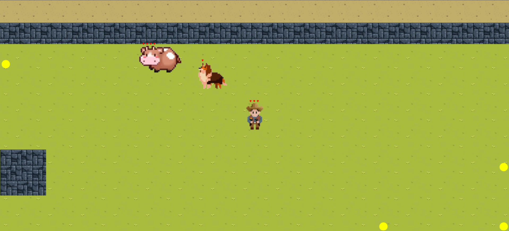

# Sheep-Shielding 🐑🛡️

Un juego web donde controlas a un pastor que protege a su rebaño de ovejas de lobos feroces. ¡Demuestra tu habilidad y estrategia para mantener a salvo a las ovejas!

## 🚀 Tecnologías

- **Frontend:** HTML, CSS, JavaScript/TypeScript.
- **Motor gráfico:** Canvas API para gráficos 2D.

## 🛠️ Requisitos

- Navegador moderno compatible con ES6+.

## 📦 Instalación

1. Clona el repositorio:

   ```bash
   git clone https://github.com/GJZ26/Sheep-Shielding.git
   cd Sheep-Shielding
   ```

2. Instala las dependencias con

```bash
 npm install
```

3. Ejecuta el juego en modo desarrollo
```bash
npm run dev
```


## 🎮 Controles del Juego

- **Movimiento del pastor:** Teclas de flecha o WASD.
- **Cambiar de dirección**: Movimiento del mouse
- **Disparar:** Click izquierdo
- **Correr**: Shift

## 🐺 Dinámica de Juego

1. **Pastor:** Controlas al pastor y puedes repeler a los lobos arrojando piedras.
2. **Ovejas:** Se mueven aleatoriamente, intentando evitar a los lobos, te seguirán para recuperar vida.
3. **Vacas:** Se mueven a menor velocidad que las ovejas pero tienen mayor puntuaje de vida que las ovejas.
4. **Lobos:** Atacan a las ovejas y lobos.
5. **Lobos Salvajes**: Atacan también al jugador, huyen al recibir daño y atacan más rápido que el lobo común.
6. **Objetivo:** Mantén a las ovejas a salvo el mayor tiempo posible.


## 🎨 Capturas de Pantalla


